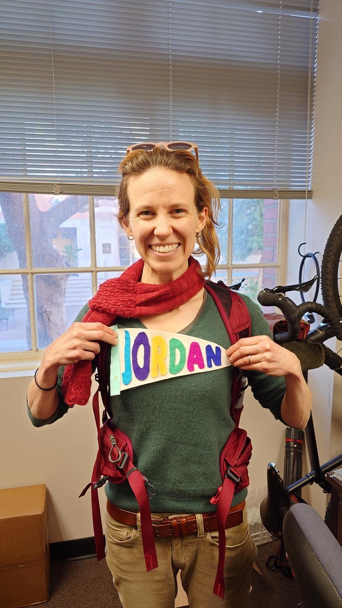

---
format:
  html:
    title-block: false
    toc: false
    sidebar: false
    include-before-body: _includes/before-body.html
---

::: {.container}
::: {#about .about}
::: {.section-title}
## About
:::

::: {.row .align-items-start}
::: {.col-lg-4 .mb-4}

:::

::: {.col-lg-8}

#### Biography
I am a PhD candidate in Earth Sciences at the University of Southern California, advised by Julien Emile-Geay. My background spans mathematics, physical oceanography, and data science, with research stints at Woods Hole Oceanographic Institution and several years in industry as a data scientist before returning to graduate school. My work sits at the intersection of paleoclimate and nonlinear time series analysis, with a recurring focus on the question of whether apparent relationships in the climate record reflect genuine dynamical influence.

#### Research Interests
The central problem motivating my research is causality in nonlinear systems. In Earth's climate, correlation is not only an unreliable guide to causal structure — it can be actively misleading: two causally linked variables can exhibit intervals of positive, negative, or no correlation depending on system state, while two unrelated variables can appear coherent because of a shared driver. Standard associative approaches, including spectral analysis, cannot resolve this ambiguity.

I use Convergent Cross Mapping (CCM) to approach these questions more carefully. CCM tests whether the state space of one variable carries recoverable information about another — a condition that, under the theory of dynamical systems, is only satisfied in the presence of genuine coupling. My dissertation applies this framework to questions in Holocene and Pleistocene paleoclimate.

:::
:::
:::

::: {#resume .resume}
::: {.section-title}
## Resume 
[(PDF)](/assets/file/jlanders_CV.pdf)

::: {.row}

::: {.col-lg-6 data-aos="fade-up"}
### Education {.resume-title}
::: {.resume-item}
#### Ph.D. Candidate, Earth Sciences
##### **2022 – present**  
*University of Southern California, Los Angeles, CA*
:::

::: {.resume-item}
#### MA, Earth and Environmental Science
##### **2010 – 2013**  
*Columbia University, New York, NY*
:::

::: {.resume-item}
#### BA, Mathematics
##### **2004 – 2009**  
*Williams College, Williamstown, MA*
:::

:::

::: {.col-lg-6 data-aos="fade-up" data-aos-delay="100"}
### Professional Experience {.resume-title}

::: {.resume-item}
#### Data Scientist, Syntouch Inc
##### **2020 – 2022**
*Haptics consulting*
:::

::: {.resume-item}
#### Data Scientist, Greenwings Biomedical Inc. (Neuroscience)
##### **2017 – 2019**
- _NSF iCorps Entrepreneurial Lead_
- _Assessing cognitive impairment using MF-DFA_
:::

::: {.resume-item}
#### Research Assistant, Woods Hole Oceanographic Institution
##### **2009 – 2010**
- _Supervisor, Delia Oppo_
- _KNR 157 + Lab work_
:::

:::
:::

:::

:::

::: {#overview .portfolio .section-bg}
::: {.section-title}
## Overview {#overview-section}
:::

:::
:::

::: {.container}

::: {#teaching .teaching}
::: {.section-title}
## Teaching & Community Involvement
### USC
  - 2026 Teaching Assistant, GEOL351: Climate Dynamics
  - 2024 Teaching Assistant, GEOL351: Climate Dynamics
  - 2023 Teaching Assistant, GEOL150: Climate Change
  - 2022 Teaching Assistant, GEOL351: Climate Dynamics

### Columbia University
  - 2012 Teaching Assistant, Chemical Oceanography
  - 2010 Teaching Assistant, Atmospheric Science

### Workshops & Outreach
  - 2024-2025 Paleo/Environmental Seminar Co-Organizer (USC)
  - 2023-2024 Graduate Student Representative (Earth Sciences Department, USC)
  - 2023 Instructor, BYOD Workshop (USC/ISI)
  - 2010 Outreach contributor, Demerara Rise Cruise Blog (WHOI)
:::
:::

::: {#contact .contact}
::: {.section-title}
## Get in touch! {#contact-section}

Think there might be an idea we could collaborate on? Have a postdoc opportunity that needs filling? Get in touch! 
(Contact information in my [CV](/assets/file/jlanders_CV.pdf) as a (likely ineffective) tactic to reduce spam.)

:::
:::

:::

