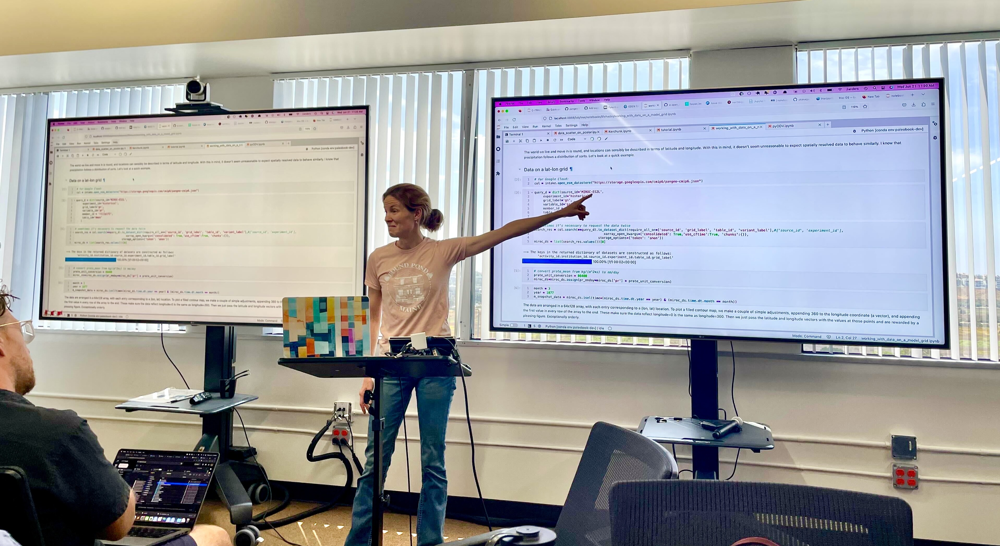
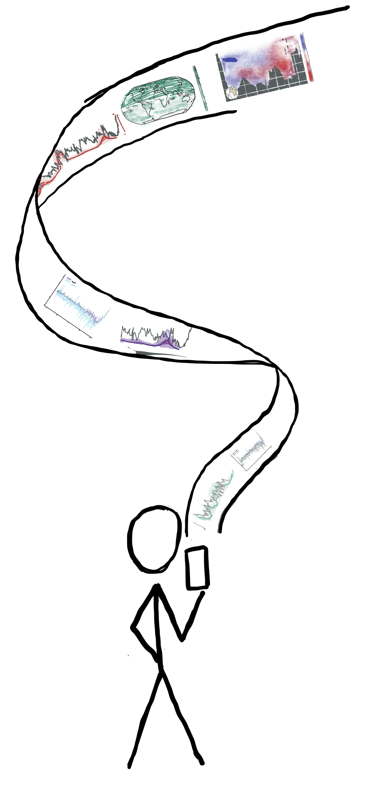
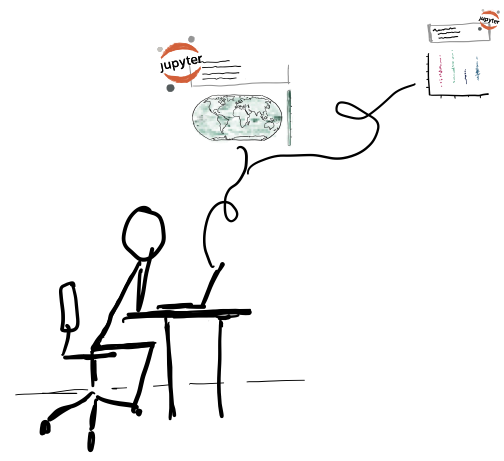

:::{.page-intro}

:::

## [PaleoBooks](https://linked.earth/PaleoBooks/) {#paleobooks}

{.img-fluid .float-end style="max-width: 200px; margin: 0 0 1em 1.5em;"}

Paleoclimate research is inherently interdisciplinary, drawing on diverse datasets, tools, and scientific backgrounds. This variety makes it challenging to communicate methods clearly and consistently, especially when key steps such as preprocessing, parameter selection, or design tradeoffs are often omitted from publications or shared code for readability.

PaleoBooks is a community-populated gallery of subject-specific materials that support transparency and reuse. Hosted at linked.earth/PaleoBooks, the collection includes didactic notebooks and modular chapters that walk through a range of workflows. Contributions vary in style and purpose, from published study supplements to teaching-ready tutorials and informal walkthroughs, and cover topics like data access, exploratory analysis, visualization, and model–data comparison. By placing narrative explanation directly alongside code and figures, these materials help make the logic of an analysis easier to see, understand, and adapt—whether guiding staple tasks or unpacking deeper caveats and tradeoffs.

{.img-fluid .float-start style="max-width: 200px; margin: 0 1em 1em 1.5em;"}
All entries are publicly available and organized in the centralized PaleoBooks Gallery, making them easier to find and share than isolated repositories or buried links. This consolidation lowers the barrier to reuse and helps researchers point students, collaborators, or reviewers to clear examples. By foregrounding the often-unwritten details behind research decisions, PaleoBooks supports FAIR-aligned practices and contributes to a broader shift toward more transparent and reusable research in the geosciences.

### References {#paleobooks-ref}

##### Posters

::: {.citation-list}
- **2025**. Landers, J.P., Emile-Geay, J., Khider,K., James, A.K., Gondhalekar, T., McKay, N., & Cropper, S.. “ PaleoBooks: A Community Gallery for Transparent and Reusable Paleoclimate Workflows". AGU Fall Meeting 2025. New Orleans, LA. Abstract IN43D-0427, December 18, 2025. [link](https://agu25.ipostersessions.com/?s=C4-52-B2-B3-D4-E1-CC-5D-B2-C2-D8-CB-04-1D-04-6D).
- **2023**. Khider, D., Ratnakar, V., Emile-Geay, J., Zhu, F., James, A.K., Landers, J.P., Gil, Y., Osorio, M., Vargas, H. & McKay, N.. "PaleoCube: Enabling cloud-based paleoclimatology". AGU Fall Meeting 2023.
- **2023**. Landers, J.P., Emile-Geay, J. & Khider, D.. "PaleoBooks: A Library of JupyterBooks for Paleoclimate Research". Building upon the EarthCube Community. Information Sciences Institute, Marina del Rey, CA.
:::

##### Presentations

::: {.citation-list}
- **2023**. Instructor, Bring Your Own Data (BYOD) Workshop (USC/ISI)
:::

## Climate Dynamics Curriculum {#geol351}

[coming soon!]