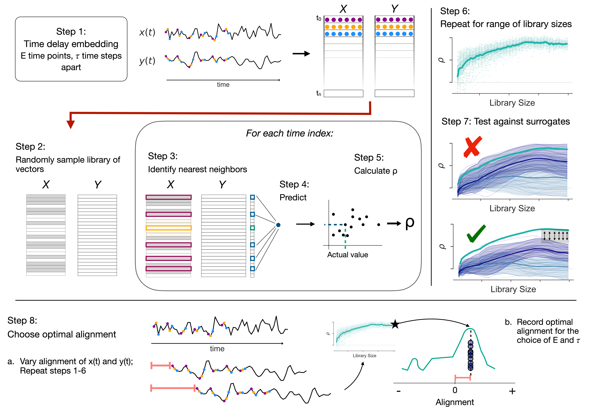
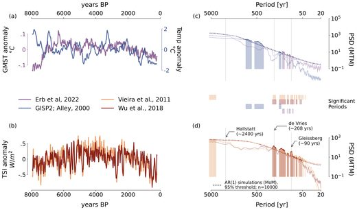
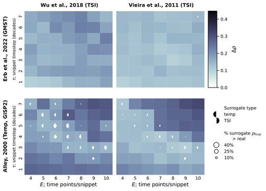
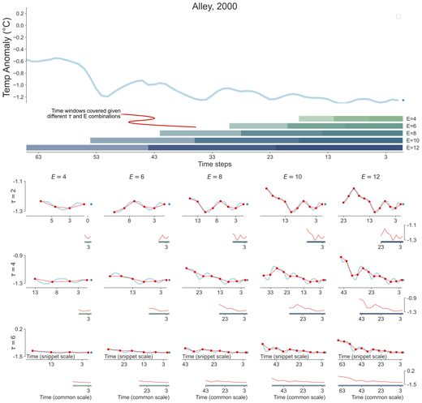
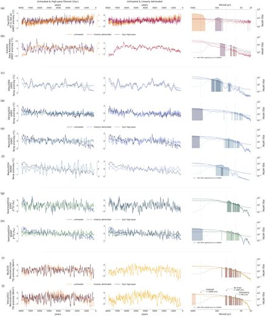

:::{.page-intro}

:::

Natural climate variability, whether endogenous or exogenous, can amplify or offset anthropogenic warming. Therefore, improving climate predictions requires understanding all factors driving this variability. Mechanistic insight from lab investigations, field experiments, and the instrumental observational record have deeply informed climate models, but their long term fidelity depends on a command of the preindustrial climate. To that end, paleoclimate records play a critical role in understanding broad dynamics, and the holy grail of paleoclimatology is identifying the causal links between actors in the climate system.

However, in nonlinear systems, such as Earth's climate, that evolve under the influence of internal states, feedback mechanisms, and external drivers, characterizing causality is no simple task. Identical perturbations can lead to different responses--variable timing and magnitude--depending on initial conditions.  Not only is it possible for two variables to show spurious correlation because of a third controlling factor, it is also possible for two variables to be causally linked and not be consistently related by the same statistical relationship. As such, associative approaches (e.g., correlation, spectral analysis), while straightforward to calculate, are not indicators of causality. 

## Methodology - Convergent Cross Mapping {#method-ccm}
Convergent Cross Mapping (CCM; Sugihara et al., 2012) takes a different approach, one rooted in dynamical systems theory. The core insight is that variables in a coupled system leave traces of each other in their histories: if X influences Y, then the past behavior of Y contains recoverable information about X. CCM tests for this by asking whether the state of one variable can be reconstructed from the state space of another, and whether that reconstruction improves as more data are used — a property called convergence. Convergence is what separates genuine coupling from spurious correlation: coupled variables predict each other increasingly well as the historical record grows (coincidentally correlated ones do not perform better with more information). Whether a given relationship counts as causal is then determined by testing this convergence against surrogate time series that preserve each record's frequency content but not its dynamics.

One challenge of this framework is that it requires evenly-spaced time series that are long enough to provide multiple examples of state, conditions that are challenging to satisfy in paleoclimate data, where records are short and unevenly sampled. However, the underlying concept is flexible and after decades of work, the paleoclimate community is starting to produce data products that can support CCM (hurray!). Now, rather than asking whether two records look alike, we can ask whether one dynamically constrains the other.

## The Holocene: Did Solar Variability Drive Surface Temperature? {#holocene_ccm}

::: {.figure-banner}
[{.figure-banner-img}](../favorite_figures/holocene_ccm/img/display/Fig1_raw_ts_psd.jpg){.portfolio-lightbox data-gallery="holoceneCcmGallery" title="Raw time series & spectral significance"}
[{.figure-banner-img}](../favorite_figures/holocene_ccm/img/display/Fig3_untreated_results_Grid_2x2.jpg){.portfolio-lightbox data-gallery="holoceneCcmGallery" title="CCM parameter-sweep results grid"}
[{.figure-banner-img}](../favorite_figures/method/img/display/FigS_embedding.jpg){.portfolio-lightbox data-gallery="methodGallery" title="State-space embedding windows"}
[{.figure-banner-img}](../favorite_figures/holocene_ccm/img/display/FigS5_real_ts_psds.jpg){.portfolio-lightbox data-gallery="holoceneCcmGallery" title="Real time series PSDs (supplementary)"}
:::

[All Holocene CCM figures →](/favorite_figures.html#fig-holocene-ccm){.figure-banner-more}

For decades, researchers have pointed to correlation and spectral similarity between reconstructions of total solar irradiance (TSI) and proxy records of Holocene temperature as evidence of solar influence on climate, but then needing to invoke nonlinear mechanisms to finish the story. Simultaneously, despite the straightforward link between Sun output and climate in an abstract sense (and using a conceptual energy balance model), in practice, the climate is complicated and noisy and it's easy to imagine a small amplitude signal like the variability in Sun output getting lost among more dramatic actors.  It makes for an interesting conundrum: conceptual link, no specific mechanism, studies reporting evidence, but evidence that is circumstantial and not consistently robust to significance testing. 

My first dissertation project applies CCM to this question directly. Using two TSI reconstructions alongside both a global multi-archive global mean surface temperature data product and the long Greenland ice core record, I tested whether solar variability had a discernible influence surface temperature over the Holocene. A key feature of this analysis is that CCM's parameter choices encode assumptions about the phasing and timescale of influence, and rather than endeavoring to find a single parameter configuration and hoping it was sufficiently representative of the climate's response to this subtle global forcing, we approached the project as a parameter sweep and interpretted the results as evidence of solar influence may exist on multiple time scales.
The results show statistically significant evidence that TSI causally influenced both global mean surface temperature and Greenland climate at multiple timescales. This finding is robust across different ice cores and TSI reconstructions and methodological configurations. The work has been accepted for publication at Geophysical Research Letters.

### References {#holocene_ccm-ref}

::: {.citation-list}
- **2026**. Landers, J.P., Emile-Geay, J., James, A.K., Munch, S.B., Bard, E., & Khider, D.. "A causal examination of the solar influence on Holocene climate". Geophy. Res. Let. Accepted.
:::

#### Talks

::: {.citation-list}
- **2025**. Landers, J.P., Emile-Geay, J., James, A.K., Munch, S.B., Bard, E., & Khider, D. "Detecting Nonlinear Solar--Climate Linkages over the Holocene with Convergent Cross-Mapping". AGU Fall Meeting 2025. [link](https://agu.confex.com/agu/agu25/meetingapp.cgi/Paper/PP11A-03).
- **2025**. J.P. Landers. "Nothing like the Sun? A causal examination of the solar influence on Holocene climate". Paleo Seminar, University of Washington. Seattle, WA.
- **2024**. J.P. Landers. "Nothing like the Sun? A causal examination of the solar influence on Holocene climate". Paleo/Environmental Seminar, University of Southern Californa. Los Angeles, CA.
:::

#### Posters

::: {.citation-list}
- **2025**. Landers, J.P., Emile-Geay, J., James, A.K., Munch, S.B., Bard, E. & Khider, D.. "Did the Sun influence Holocene climate?". 15th International Conference on Paleoceanography (ICP15). Bengaluru, India.
:::

## The Pleistocene: Orbital Forcing and the 100,000-Year Problem

One of the enduring puzzles in paleoclimate is the mismatch between orbital forcing and the dominant periodicity of glacial–interglacial cycles. Milankovitch theory links ice ages to cyclical changes in Earth's orbital geometry and the resulting distribution of insolation — yet geologic records are dominated by a roughly 100,000-year signal, while the orbital parameter at that frequency, eccentricity, contributes only weakly to insolation variance. Are the ice sheets and climate responding strongly to a weak forcing, or is it coincidence?